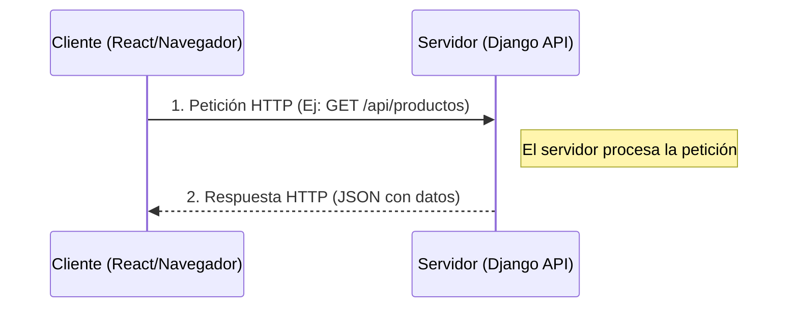
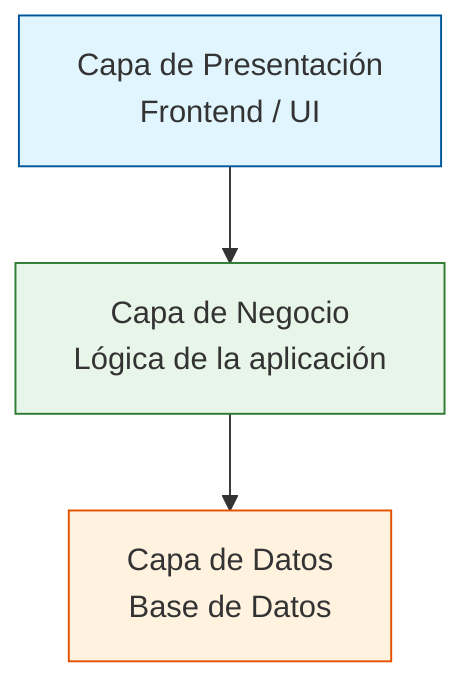
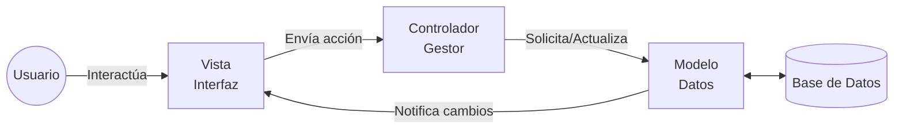
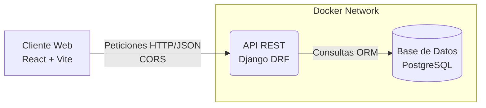
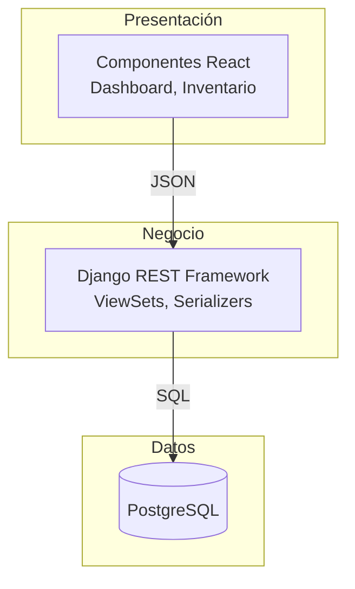

# Guía de Estudio - Práctica 2: Análisis y Desarrollo de una Aplicación Web con API

Esta guía está diseñada específicamente para tu examen. Combina la teoría requerida por la rúbrica de la práctica con la implementación real que realizaste en tu proyecto **TechStore** (usando Django REST Framework y React).

---

## Parte 1: Investigación y Análisis (Conceptos Teóricos)

### 1. Clasificación de Aplicaciones Web

*   **Página Web**
    *   **Definición:** Documento electrónico que contiene información básica (texto, imágenes, enlaces), típicamente escrito en HTML. Suele ser estática.
    *   **Características:** No requiere procesamiento complejo en el servidor, no suele tener conexión a base de datos, carga rápida, solo informativa.
    *   **Ejemplo real:** Una página de aterrizaje (Landing Page) estática o la página "Acerca de nosotros" de un restaurante.
*   **Sitio Web**
    *   **Definición:** Un conjunto de páginas web relacionadas y enlazadas entre sí, alojadas bajo un mismo nombre de dominio.
    *   **Características:** Navegación estructurada (menús), suele combinar contenido estático y algo de dinamismo.
    *   **Ejemplo real:** Wikipedia, un blog de noticias o un portafolio fotográfico.
*   **Sistema Web / Aplicación Web**
    *   **Definición:** Un programa de software complejo que se ejecuta en un servidor web y se accede a través de un navegador. Ofrece interactividad y manipulación de datos.
    *   **Características:** Requiere autenticación, manipula bases de datos, contiene lógica de negocio, contenido dinámico basado en el usuario.
    *   **Ejemplo real:** **Tu proyecto TechStore**, Amazon, Netflix o el portal escolar de la universidad.
*   **API (Interfaz de Programación de Aplicaciones)**
    *   **Definición:** Conjunto de reglas y protocolos que permite a diferentes sistemas de software comunicarse entre sí sin intervención humana directa. No tiene interfaz gráfica (GUI).
    *   **Características:** Facilita la integración, suele intercambiar datos en formato JSON o XML, es *stateless* (sin estado), responde a verbos HTTP (GET, POST, PUT, DELETE).
    *   **Ejemplo real:** **La API REST que construiste con Django** para servir los productos, o la API de Google Maps.

### 2. Arquitecturas de Aplicaciones Web

#### Modelo Cliente-Servidor
Es el fundamento de la web. El "Cliente" (navegador) hace una petición, y el "Servidor" (backend) la procesa y responde.

*   **Cliente:** Quien solicita recursos y muestra la interfaz (React).
*   **Servidor:** Quien provee los recursos y maneja los datos (Django).
*   **Flujo de comunicación:** Petición (Request) -> Procesamiento -> Respuesta (Response).

#### Modelo de Tres Capas
Divide la aplicación de forma lógica para separar responsabilidades.

*   **Capa de Presentación:** Muestra la información y captura acciones del usuario (En tu proyecto: React).
*   **Capa de Negocio:** Contiene las reglas del negocio y procesa la información (En tu proyecto: Django / Views / Serializers).
*   **Capa de Datos:** Se encarga de almacenar y recuperar la información (En tu proyecto: PostgreSQL).

#### Modelo Vista-Controlador (MVC)
Es un patrón de diseño que separa los datos, la interfaz y la lógica de control. *Nota: Django usa una variante llamada MVT (Model-View-Template), pero a nivel general de aplicación el concepto es el mismo.*

*   **Modelo:** Representa la estructura de datos y las reglas del negocio (Clase `Producto` en `models.py`).
*   **Vista:** La interfaz gráfica de usuario (Componentes de React, el Dashboard).
*   **Controlador:** Intermediario que recibe las entradas, actualiza el modelo y refresca la vista (Views/ViewSets en Django y los handlers en React).

### 3. Arquitecturas de APIs

*   **API de Acceso a Datos (RESTful):** Exponen operaciones sobre recursos (CRUD) mediante HTTP. *Ejemplo: La API de tu proyecto TechStore que da acceso a la base de datos de productos mediante endpoints.*
*   **API Cliente-Servidor:** Modelo estándar donde un cliente consume servicios que están centralizados en un servidor.
*   **API Punto a Punto (P2P):** Arquitectura descentralizada donde los nodos actúan como clientes y servidores al mismo tiempo. *Ejemplo: BitTorrent, aplicaciones blockchain.*
*   **API de Comunicación en Tiempo Real:** Mantienen una conexión abierta constantemente para enviar datos al instante (WebSockets). *Ejemplo: Chats en vivo (WhatsApp Web), sistemas de notificaciones push o juegos multijugador.*

---

## Parte 2: Diseño del Sistema (Aplicado a tu Proyecto TechStore)

### Diagrama de Arquitectura (Infraestructura real)

### Diagrama de Tres Capas (Lógica)

---

## Parte 3: Desarrollo Backend y Tecnologías Elegidas

Si el profesor pregunta: **"¿Por qué elegiste estas tecnologías y no Node.js o Flask?"**, aquí tienes tus argumentos (basados en tu reporte):

1.  **Backend: Python + Django REST Framework (DRF)**
    *   **¿Por qué?** Django abstrae las consultas SQL con un ORM muy potente e incluye migraciones. DRF permite crear los endpoints CRUD completos con muy pocas líneas de código gracias a `ModelViewSet` y los serializadores (`ModelSerializer`), ahorrando mucho tiempo en comparación a hacer las rutas manualmente en Express o Flask.
2.  **Frontend: React + Vite + TypeScript**
    *   **¿Por qué?** React permite crear UIs dinámicas por componentes. Vite ofrece tiempos de carga y actualización rapidísimos en desarrollo. TypeScript ayuda a evitar errores tipando los datos que llegan de la API.
3.  **Base de Datos: PostgreSQL**
    *   **¿Por qué?** Base de datos relacional robusta que encaja perfecto con la estructura estricta del modelo `Producto`.
4.  **Orquestación: Docker**
    *   **¿Por qué?** Encapsula los 3 servicios (Frontend, Backend, DB). Evita el problema de "en mi máquina sí funciona" y simplifica la conexión de la red.

### Estructura de Endpoints de tu API
Tu objeto principal es el **Producto** (`id`, `nombre`, `precio`, `categoria`, `stock`, `proveedor`, `estado`).

*   **Obtener todos los productos:**
    *   `GET /api/productos/` -> Devuelve un Array JSON `[{}, {}]`.
*   **Consultar producto por ID:**
    *   `GET /api/productos/1/` -> Devuelve el objeto con ID 1.
*   **Registrar producto:**
    *   `POST /api/productos/` -> Recibe un JSON en el *body* y lo guarda en la BD.
*   **Actualizar producto:**
    *   `PUT /api/productos/1/` -> Actualiza todo el producto.
*   **Eliminar producto:**
    *   `DELETE /api/productos/1/` -> Borra el recurso.

---

## Parte 4: Consumo de la API e Integración

Para esta fase, el proyecto incluyó las siguientes consideraciones clave (¡puntos extra si los mencionas en el examen!):

1.  **CORS (Cross-Origin Resource Sharing):**
    *   Al tener el frontend en un puerto (`5173`) y el backend en otro (`8000`), el navegador bloquea las peticiones por seguridad. Tuviste que configurar `django-cors-headers` en el backend para permitir que React accediera a la API.
2.  **Manejo de Estado Asíncrono:**
    *   El frontend hace llamadas a la API usando `fetch` o `axios` en un estado asíncrono. Mientras se esperan los datos del `GET /api/productos`, React muestra un estado de "Cargando".
3.  **Pruebas con herramientas externas:**
    *   Antes de conectar React, los endpoints se prueban usando herramientas como **Postman**, **Insomnia**, **Thunder Client**, o la propia interfaz web que autogenera Django REST Framework. Esto valida que el JSON y los códigos de estado HTTP (200 OK, 201 Created, 404 Not Found) estén correctos.
4.  **Consumo final:**
    *   React recibe la lista JSON, la guarda en su estado (`useState`), calcula los KPIs (Total de productos, Valor de inventario, etc.) y genera la tabla y las gráficas dinámicamente.
